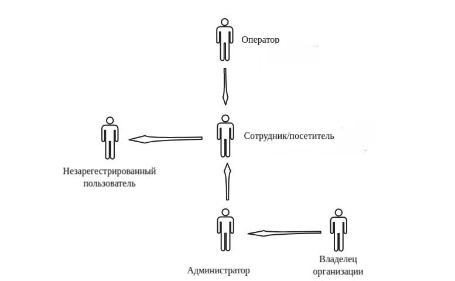

## Общее положение

### Цель создания проекта
1. С точки зрения организации
    * Обеспечение контроля доступа на объкет (офис)
    * Удобный контроль посящаемости робочего места сотрудниками
    * Простота внедрения. Нет неоходимости устанавливать спецальное ПО на офисные комьютеры
2. С точки зрения клиента
    * Удобный доступ на объект
    * Возможность просмотра статистики посещения рабочего места
### Основные функциональные возможности Системы
1. Backend
    * Распознование лиц в видеопотоке

    * Определение вероятности потделки идентификатора (лица)
    
    * Возможность изменения режимы пропусоного контроля. Мягкий (в журнале событий будет отражен факт нарушения доступа, но система пропустит человека), временной (ориентир – время, руководствуясь которым система запрещает доступ в зону вплоть до выхода), строгий (система категорически запрещает повторный доступ до момента выхода)

    * Автоматическое добавление событий в базу данных исходя из анализа видео потока

    * Добавление неопознаных лиц в базу данных и присвоение ему уникального идентификатора (?)

    * Добавить/удалить отдел или подотдел

    * Добавить/изменить/удалить список сотрудников/посетителей, имеющих доступ на объект + описание фото и др. информация.

    * Добавить/изменить/удалить список идентификаторов сотрудника/посетителя

    * Возможность устаналивать разлиные варианты ограничений доступа на объект для сотрудника/посетителя

    * Добвление/изменение/удаление режимов доступа на объект + описание название и др. информация

    * Отчеты для владельца организации (?)

2. Frontend
    * Для оператора (охранника) (?)
        * Отображение видопотока с камеры видоналдения + выделение области лица посетителя с кратной информацие о нем

        * Возможность просмотра лога событий в реальном времени

    * Для администратора системы
        * Найти необходимого сотрудника/посетителя

        * Найти необходимы отдел или подотдел

        * Администрирование сотрудников/посетителей: внесение изменений в список объетов доступа, изменение списка идентификаторов объета доступа, присвоение ограничений для доспупа на объект для объекта(ов) доступа

    * Для руговодящих органов организации
        * Возможность просмотра статистики посящений сотрудника(ов)/посетителя(ей)

        * Возможность получения аналитической информиции о посещяемости сотрудника(ов)/посетителя(ей) (графики, средниние показатели и т.д)

        * Все возможножная сортировка и фильтрация данных статистики и аналитики

        * Отправка уведомлений сотруднику(ам) (?)

    * Для объетов доступа
        * Возможность просмотра личной статистики посещяемости

        * Возможность просмотра собственной аналитической информации о посещяемости рабочего места (графики, средниние показатели и т.д)

        * Все возможножная сортировка и фильтрация данных статистики и аналитики

        * Возможность прочитать уведомления
## Фунциональные требования
### Диаграммы Вариантов использования
**Диаграмма 1. Действующие лица**

На данной диаграмме представлена иерархия всех Пользователей Системы и внешних
участников. Связь обобщения следует читать следующим образом: Пользователь наследует все
поведение своего родителя + имеет свое поведение в Системе.

**TODO: доделать диаграммы вариантов использования**

## Описание Вариантов Использования
### ВИ "Создать объект доступа"
**Описание ВИ**

* Должна быть возможность зарегестрировать сотрудника/посетителя в системе

**Предусловия**

* Сотрудник/посетитель не зарегестрирован в системе (не создана запись в списке объетов доступа с его персональными данными)

**Основной поток действий**

1. Администратор заходит в раздел "Объекты доступа"

2. Администратор нажимает на кнопку "Создать объект доступа". В зависимости от того существут ли отдел к которому преписан сотрудник:
    * Если существут отдел к которому преписан сотрудник, то необходимо нажать на существующий отдел в дереве объектов доступа
    * Если отдела не существует необходимо нажать на корневой элемента дерева объектов доступа
    * Для постетителей в дереве объетов доступа существует отдельный объект "Посетители"

3. Система оторажает форму создания объкта доступа

4. Адимистратор вводит информацию о сотруднике/посетителе, вносит идентификаторы в список идентификаторо сотрудника/посетителя, так же он имеет возможность назначить уровень доступа, установить ограничения достпу на объект. Если администратор отменят действие форма создания объекта достпу закрывается.

5. Система проверят, что необходимые поля введены корректно. Если проверка прошла успешно, то поток продолжается, иначе сценарий переходит в п. 4, причем все значения (правильные и неправильные) должны отображаться в заполненных ранее полях с выделением неправильного поля и комментариями о существовании такого сотрудники/посетителя.

6. Система делат следующие действия:
    * Система регестрирует сотрудника/посетителя с веденными ранее параметрами
    * Система переобучает классификатор модуля распознования лиц на основании списка идентификаторов сотрудника/посетителя
    * Система блокирует интерфейс до получения ответа от сервера
    * Система оповещает администратора о успешности создания записи сотрудника/пользователя и обучении классификатора

        

